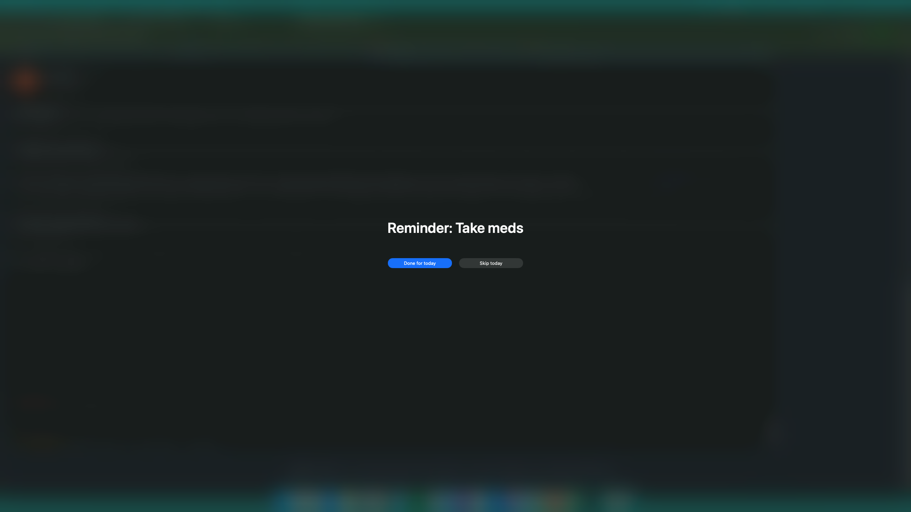
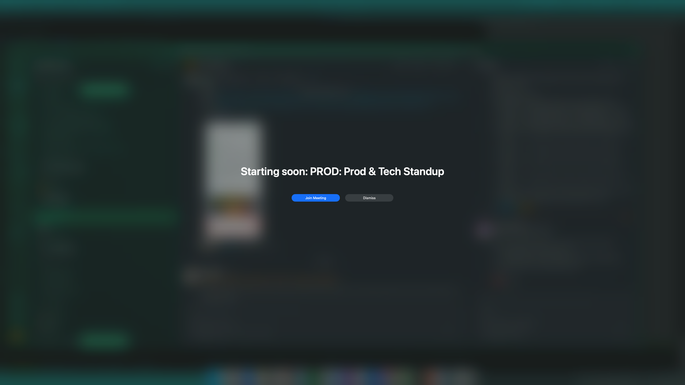
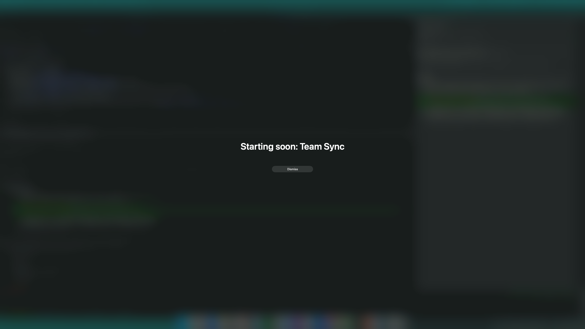

# Badger

A free, open-source alternative to [InYourFace](https://inyourface.app) built
for developers. It's a local macOS app that nags you with a full-screen,
blurred overlay until you mark a recurring daily task done, and can also warn
you 2 minutes before a Google Calendar meeting starts with a one-click join
button — built because notification banners are too easy to ignore.

Unlike InYourFace, Badger is entirely local, config-file-driven, and ships
with a Claude Code skill so you can manage reminders conversationally — no
account, no paid tiers, no GUI required to set things up.



- Each checklist item has its own interval and active time window (default:
  every 15 minutes, 08:00-22:00).
- When an item is due, a full-screen blurred overlay (like DeskMinder) covers
  every display with **Done for today** and **Skip today** buttons — it won't
  go away on its own.
- Optionally, the same overlay fires 2 minutes before a calendar meeting
  starts, with a **Join Meeting** button that opens the video-call link
  directly — see [Meeting reminders](#meeting-reminders-google-calendar-via-eventkit).
- Runs automatically at login via a `launchd` agent.
- Every done/skipped/missed/meeting event is logged for a full daily
  adherence history.
- A menu bar icon shows today's status at a glance, and lets you pause
  reminders or open the history without touching the CLI.

## Contents

- [Setup](#setup)
- [Checklist reminders](#checklist-reminders)
- [Meeting reminders (Google Calendar via EventKit)](#meeting-reminders-google-calendar-via-eventkit)
- [Menu bar icon](#menu-bar-icon)
- [Claude Code integration](#claude-code-integration)
- [Managing the background service](#managing-the-background-service)
- [How the overlay works](#how-the-overlay-works)

## Setup

```
./setup.sh
```

This creates a virtualenv, installs dependencies, creates `config.yaml` from
`config.example.yaml` if it doesn't exist yet, installs the Claude Code skill,
and loads two `launchd` agents — the checker and the menu bar icon — so both
start running immediately (and again automatically at every login).

Then add the CLI to your `PATH` (setup.sh will print this line if it's not
already in `~/.zshrc`):

```
export PATH="$HOME/badger/bin:$PATH"
```

## Checklist reminders

### `badger add <name> [options]`

Add a new checklist item.

```
badger add "Take medicine" --interval 15 --start 08:00 --end 22:00
badger add "Drink water"                        # uses the defaults (every 15m, 08:00-22:00, every day)
badger add "Take out trash" --days sun          # only nags on Sundays
badger add "Gym" --days weekdays --start 06:00 --end 09:00
```

- `--interval <minutes>` — how often to re-nag while the item is due (default: `15`)
- `--start <HH:MM>` / `--end <HH:MM>` — active time window, 24h format (default: `08:00`-`22:00`)
- `--days <spec>` — which days it's active. Comma-separated day abbreviations
  (`mon,tue,wed,thu,fri,sat,sun`), or one of `weekdays`, `weekends`, `all`/`daily`/`everyday`
  (default: `all`)

### `badger update <name> [options]`

Change an existing item's interval, window, or days. Same flags as `add`; only
the flags you pass are changed, the rest are left as-is.

```
badger update "Take medicine" --interval 30
badger update "Gym" --days weekends --start 08:00 --end 10:00
```

### `badger remove <name>`

Delete an item from the checklist.

```
badger remove "Drink water"
```

### `badger list`

Print every configured item with its interval, window, and active days.

```
badger list
```

### `badger status`

Show each item's status for today (`pending` / `done` / `skipped`), when that
status was set, and whether it's currently in its active window.

```
badger status
badger status --json     # machine-readable, used by the menu bar icon
```

### `badger pause` / `badger resume`

Stop (or restart) all badging — checklist items and meeting reminders — until
resumed. The background checker keeps running and checking in, it just won't
show any overlays while paused. Also available from the menu bar icon.

```
badger pause
badger resume
```

### `badger history [options]`

Show the done/skipped/missed event log.

```
badger history                                  # last 7 days, all items
badger history --item "Take medicine" --days 30
```

- `--item <name>` — filter to one item (default: all items)
- `--days <n>` — how many days back to show (default: `7`)

`config.yaml` is your personal, hand-editable checklist — it's gitignored
because it may name real medications. Only `config.example.yaml` is committed.

## Meeting reminders (Google Calendar via EventKit)

Badger can also show the same kind of full-screen overlay 2 minutes
before a Google Calendar meeting starts, with a **Join Meeting** button that
opens the video-call link directly. It's off by default.



If no join link could be detected for the event, only a **Dismiss** button
is shown instead:



This reads events from macOS Calendar.app via **EventKit**, not the Google
Calendar API — so it relies on your Google account already being synced into
Calendar.app (System Settings > Internet Accounts, or added directly in
Calendar.app), and needs no OAuth setup. The join link is taken from the
event's URL field, falling back to searching its location/notes for a
Meet/Zoom/Teams/etc. link.

### One-time Calendar permission

The first time `setup.sh` runs (or is re-run after `bin/calendar-events` is
rebuilt), it triggers a standard macOS permission prompt — approve it in
System Settings > Privacy & Security > Calendars. Because the binary is
ad-hoc code-signed, **rebuilding it changes its signature**, and macOS will
ask you to re-approve access after any future rebuild. You can also trigger
this manually:

```
bin/calendar-events check-auth            # see current status, never prompts
bin/calendar-events request-access        # trigger the permission prompt
```

### Enabling it

Add a `calendar:` block to `config.yaml` (see the commented-out example in
`config.example.yaml`):

```yaml
calendar:
  enabled: true
  lookahead_minutes: 2        # show the overlay this many minutes before start
  poll_window_minutes: 15     # how far ahead to query Calendar.app each tick
  prompt_timeout_seconds: 90  # how long the meeting overlay waits before giving up
  ignore_declined: true       # skip events you've declined
  ignore_all_day: true        # skip all-day events
```

Each meeting is only notified once, regardless of whether you click Join,
Dismiss, or let it time out — unlike checklist items, meetings aren't
recurring nags.

### `badger calendar list [--hours N]`

Debug/inspection command: prints upcoming events (default: next 2 hours) and
whatever join link was detected for each, without the 2-minute gating.

### `badger calendar test`

Force-shows the meeting overlay for the soonest upcoming event that has a
detected join link, bypassing the 2-minute gate — useful for testing the
overlay UI without waiting for a real meeting. It never writes to the
dedupe state, so it won't suppress the real reminder later.

Results show up via the normal `badger history` command as `meeting_join`,
`meeting_dismiss`, or `meeting_timeout` events.

## Menu bar icon

Badger runs a small persistent status item (`bin/statusbar`, loaded by its
own `launchd` agent) that shows the badger mark in the menu bar. Click it to
see a live view of today's checklist:

- A colored dot per item (green = done, yellow = pending, gray = skipped or
  missed) with the time it was marked, refreshed every time you open the menu.
- **Open History…** — runs `badger history` in a new Terminal tab.
- **Pause Reminders** / **Resume Reminders** — stops the checker from badging
  you (checklist items and meeting reminders both) until you resume, without
  unloading the background agent. Equivalent to `badger pause` / `badger resume`.
- **Quit Badger** — stops the background checker (`com.badger.checker`) and
  then quits the menu bar icon itself, so no more badging until you run
  `setup.sh` again or manually `launchctl bootstrap` the checker back (below).

The icon is a macOS "template image" (outline + stripes only, no fill), so it
automatically renders in black or white to match your current menu bar
appearance.

## Claude Code integration

A global Claude Code skill (`~/.claude/skills/badger/`) lets you manage
reminders conversationally from any directory, e.g. "remind me to stretch
every hour" or "is my reminder service running?". The skill source lives in
`claude-skill/SKILL.md` and is installed by `setup.sh`.

## Managing the background service

```
launchctl list | grep com.badger.checker        # check it's running
launchctl kickstart -k gui/$(id -u)/com.badger.checker   # force an immediate tick
launchctl bootout gui/$(id -u)/com.badger.checker        # stop it
tail -f data/checker.log data/checker.err.log                # watch activity/errors
```

The menu bar icon is a second, independent agent:

```
launchctl list | grep com.badger.statusbar       # check it's running
launchctl bootout gui/$(id -u)/com.badger.statusbar  # stop it (or click Quit Badger)
tail -f data/statusbar.log data/statusbar.err.log    # watch activity/errors
```

## How the overlay works

The reminder popup (`overlay-src/overlay.swift`) is a small compiled Swift
binary (built by `setup.sh` into `bin/overlay`) that shows a borderless,
screen-saver-level `NSWindow` per display with an `NSVisualEffectView` for the
blur, and real "Done for today"/"Skip today" buttons on the screen under your
cursor. It's a compiled binary rather than a script, because a manually
driven `NSApplication` run from an interpreted process (both plain
Python/PyObjC and JXA via `osascript`) could display the windows fine but
never actually became the key/active app, so real mouse clicks on the
buttons were silently swallowed as mere focus-steal attempts. A compiled
process running a real `NSApp.run()` event loop becomes key/main/active
correctly.
